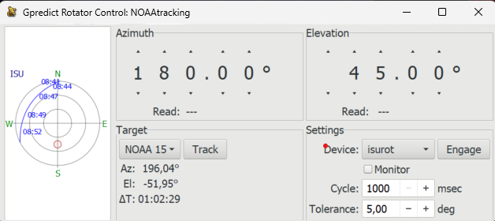

# TCP to Serial Antenna Control

This repository provides a bridge application that connects **Gpredict** satellite tracking software to legacy serial-controlled antenna systems, specifically designed for **M2 Antenna Systems, Inc. Model No: RC2800PXEL** azimuth and elevation motor controllers.

## Overview

The application acts as a TCP-to-Serial gateway, enabling modern satellite tracking software (Gpredict) to control older antenna positioning systems that communicate via RS-232/serial protocols. This is particularly useful for amateur radio operators and satellite enthusiasts who want to use modern tracking software with existing antenna infrastructure.

## Hardware Compatibility

This software is specifically designed and tested with:
- **M2 Antenna Systems, Inc.**
- **Model No: RC2800PXEL** 
- Azimuth and Elevation Motor Controllers

The controllers use serial communication with specific command formats that this bridge translates from Gpredict's rotctl protocol.

## How It Works

### System Architecture

```
[Gpredict] ←→ [TCP Socket] ←→ [Python Bridge] ←→ [Serial Ports] ←→ [M2 Controllers] ←→ [Antenna Motors]
```

### Communication Flow

1. **Gpredict Connection**: The application creates a TCP server on localhost:4533 (standard rotctl port)
2. **Command Translation**: 
   - Receives rotctl commands from Gpredict via TCP
   - Translates them to M2 controller serial protocol
   - Sends position commands to azimuth (COM3) and elevation (COM4) controllers
3. **Position Feedback**:
   - Continuously reads position feedback from both controllers
   - Updates current position variables in real-time
   - Responds to Gpredict position queries with actual antenna position

### Supported Commands

- **Position Query (`p`)**: Returns current azimuth and elevation in degrees
- **Move Command (`P az el`)**: Commands antenna to move to specified azimuth and elevation

### Serial Protocol

The M2 controllers expect commands in the format:
- **Azimuth**: `A<degrees>\r` (e.g., `A180.5\r`)
- **Elevation**: `E<degrees>\r` (e.g., `E45.0\r`)

Feedback format from controllers:
- **Position**: `A=180.5 S=0 M` or `E=45.0 S=0 M`
- **Errors**: `ERR=<error_code>`

## Configuration

Before running, update the COM port settings in the script:
```python
COM_AZ = "COM3"   # Replace with your azimuth COM port
COM_EL = "COM4"   # Replace with your elevation COM port
```

## Usage with Gpredict

1. **Start the Bridge**: Run `python tcp_to_serial_antena_control.py`
2. **Configure Gpredict**:
   - Go to Edit → Preferences → Interfaces → Rotators
   - Add a new rotator configuration
   - Set Host: `localhost`
   - Set Port: `4533`

## Features

- **Thread-safe operation** with multiple serial connections
- **Real-time position feedback** from antenna controllers  
- **Error handling** for serial communication issues
- **Automatic reconnection** handling for TCP clients
- **Daemon threads** for continuous operation

## Installation Requirements

```bash
pip install pyserial
```

## Images




